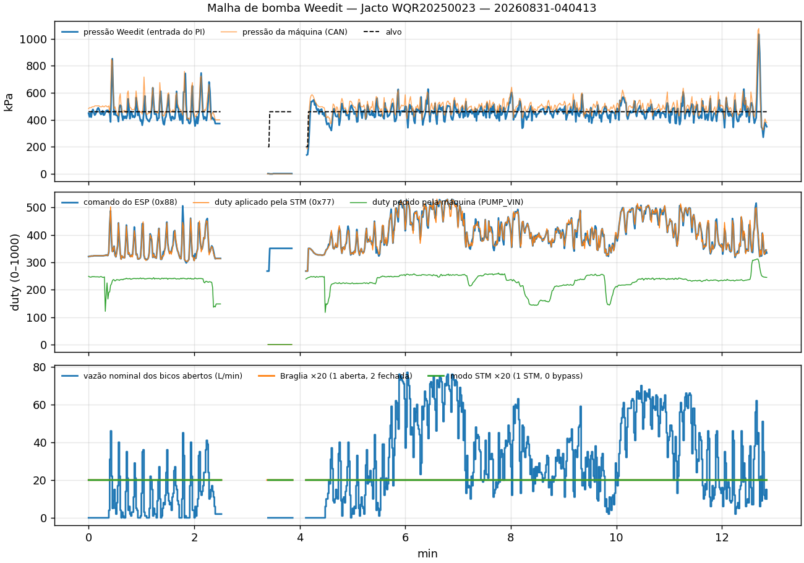
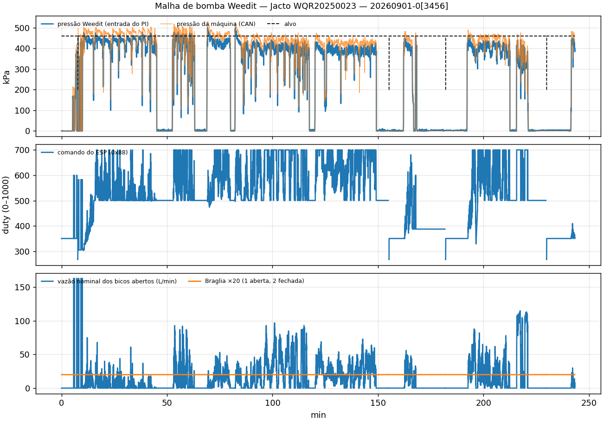

# Controle de bomba Weedit na Jacto 3030/4530

Guia de referência do sistema que regula a pressão da barra de um pulverizador Jacto 3030/4530
quando o kit Weedit (pulverização localizada) está instalado. Cobre os equipamentos, a
comunicação entre eles, a física do efeito na pulverização e a teoria de controle por trás do
firmware. A última parte confronta tudo isso com os logs da máquina **WQR20250023**
(`machineModel` 7, Fazenda Santa Terezinha, 31/08 a 03/09/2026).

Convenções:
- `arquivo:linha` aponta para o código. O section controller é `section-controller`, branch `test`,
  idêntico nos arquivos citados ao commit `4f29b76` gravado no cabeçalho dos logs. A placa da
  bomba é `smart_pump/sprayer_PWM`, branch `dev-720-firmware-upload` (`30b8259`). Os documentos da
  placa (`docs/*.md`) estão no branch `origin/test-field`.
- *Duty* é sempre em permilagem, de 0 a 1000 (500 = 50 %).
- O que vem do código é afirmado. O que é inferência está marcado como **não confirmado**.
- Todo número de log sai de `guides/fig_malha_jacto.py` (seção 7).

---

## 1. Resumo

| Pergunta | Resposta |
|---|---|
| O Weedit controla a bomba da Jacto? | **Sim, quando a placa da bomba está no barramento.** O section controller (ESP32) roda uma malha fechada de pressão e manda o duty da bomba por CAN. A placa da bomba (STM32) troca o sinal de comando da máquina por esse duty. |
| Que variável é controlada? | A **pressão da barra** medida pelo sensor do Weedit. O alvo é a pressão nominal configurada no monitor Weedit (460 kPa em 31/08). |
| Que tipo de controlador? | Um feedforward por modelo, a partir da pressão alvo e da vazão nominal dos bicos abertos, mais **dois integradores puros** (sem termo proporcional), um com ganho fixo e outro com ganho proporcional à vazão. A saída é saturada entre 100 e 700. |
| E o controlador de fábrica da Jacto? | Continua ligado, mas é enganado. A placa entrega a ele um sinal de rpm "falsificado", coerente com o duty que **ele** pediu, para que não brigue com o Weedit. Ele ainda manda no liga/desliga: se o duty dele cai abaixo de 3 %, a placa zera a bomba. |
| Funcionou na WQR20250023? | **Em 31/08 (manhã), sim.** A placa obedece ao comando, os integradores ficam estáveis e o erro médio fica perto de 0. **De 01/09 em diante, não.** A placa parou de responder no CAN, os integradores saturam em +100 e a pressão fica ~60 kPa abaixo do alvo. A pressão nesses dias é a que a máquina produz sozinha. |

```
                     ┌──────────── Weedit monitor ────────────┐
                     │ pressão nominal (alvo), bicos abertos, │
                     │ PWM de cada bico, pressão do sensor    │
                     └───────────────┬────────────────────────┘
                                     │ serial
                           ┌─────────▼──────────┐   CAN 0x18888888 (0x88 duty, 0xAA vazão/Braglia)
                           │ section controller │ ───────────────────────────────┐
                           │ ESP32-S3           │ ◄────────────┐                 │
                           │ pumpController (PI)│  0x1888888A  │                 │
                           └─────────▲──────────┘  (0x77, 0xDE)│                 │
              CAN 0x1AFFFFF9/ED/FC/FF│                         │                 ▼
                           ┌─────────┴──────────┐   PUMP_VIN   ┌┴─────────────────────────┐
                           │ controlador de taxa├─────────────►│ placa da bomba (STM32F103)│
                           │ da Jacto (fábrica) │◄─────────────┤ "HydroSync" / smart pump  │
                           └────────────────────┘  FLOW_OUT    └──┬────────────────┬───────┘
                                                (rpm falsificado) │ PUMP_OUT PB7   │ BRAG PB4/PB5
                                                                  ▼ (PWM 250 Hz)   ▼ (ponte H)
                                                   válvula hidráulica    válvula Braglia
                                                   proporcional → rpm    (alívio/retorno)
                                                   da bomba de pistão
```

---

## 2. Equipamentos

### 2.1 Pulverizador Jacto 3030/4530 (o que importa para o controle)

| Item | Valor | Fonte |
|---|---|---|
| Configuração na WQR20250023 | `machineModel` 7 = "Jacto 3030/4530, 36m (50-50cm)", 144 bicos, 36 sensores, 8 seções originais | `section-controller/src/canMap.cpp:381-428` |
| Bomba | **pistão, deslocamento positivo**. 540 rpm = 300 L/min → **0,556 L/rev** (placa), 0,555 L/rev medido em campo | `smart_pump/.../docs/JACTO_RPM_CASCADE.md` §1 |
| Acionamento | motor hidráulico por **válvula hidráulica proporcional** comandada por PWM. Medido em outra Jacto (WQR20240009): rpm ≈ 1,21·duty − 166 entre 300 e 500 de duty, zona morta de ~14 %, patamar de 461 rpm acima de 550 | `docs/JACTO_FLOW_LOGIC3.md` |
| Controlador de taxa de fábrica | fecha a malha **num sensor de rpm da bomba**, não num fluxômetro. Comanda a válvula com um sinal analógico/PWM de duty | `docs/JACTO_FLOW_VALUES.md` |
| Circuito | com recirculação e linhas longas. O operador relata atraso de até **15 s** na resposta da pressão a um degrau de duty, enquanto o rpm responde em menos de 0,5 s | `docs/JACTO_RPM_CASCADE.md` §1 |
| Válvula Braglia | válvula de alívio/recirculação. Aberta, devolve parte da vazão ao tanque. Nenhum frame CAN da Jacto informa o estado dela | `docs/JACTO_BRAGLIA_CAN.md` |
| Sensor de pressão da máquina | vai no CAN `0x1AFFFFF9` em psi. Bate com o sensor do Weedit (corr 0,985) | dev_log 2026-10-07 §3 |

### 2.2 Placa da bomba (STM32F103, "HydroSync", firmware `smart_pump/sprayer_PWM`)

Fica **em série** entre o controlador da Jacto e a válvula da bomba, e também entre o sensor de
rpm e o controlador.

| Pino | Nome | Função | Código |
|---|---|---|---|
| `PB7` | `PUMP_OUT` | PWM de saída para a válvula da bomba (TIM4 CH2, chave de lado alto IRF7416). Frequência vem do ESP (250 Hz na Jacto), resolução 1000 | `include/config.h:14`, `src/app/main.cpp:204-245` |
| `PB11` | `MCH_DIG_PUMP` | sinal de comando da máquina. Em bypass é copiado direto para `PB7` | `config.h:13`, `main.cpp:742-751` |
| `A0` | `PUMP_VIN` | o mesmo sinal da máquina lido como tensão média → `analog_duty` (0–1000) | `config.h:15`, `main.cpp:780-805` |
| `PA8` | `FLOW_OUT` | trem de pulsos entregue ao controlador da Jacto no lugar do sensor de rpm | `config.h:21`, `main.cpp:873-960` |
| `PB14`/`PB13` | `FLOW_IN` | entrada de pulsos (fluxômetro ou sensor de rpm, conforme a instalação) | `config.h:19-20` |
| `PB4`/`PB5` | `BRAG_IN1/2` | ponte H DRV8871 da Braglia: `10` = abre, `01` = fecha, `00` = máquina | `config.h:24-25`, `main.cpp:1061-1079` |

Proteções do firmware:
- **Timeout do ESP de 2 s.** Sem frame `0x88` por 2 s, a placa entra em bypass (sinal da máquina
  passa direto) e abre a Braglia (`main.cpp:345-356`).
- **Intertravamento pelo duty da máquina.** Se `analog_duty` < 30 (3 %) por mais de ~20 leituras,
  `flag_low_duty` zera o duty aplicado (`main.cpp:430-433`, `:791-804`). Quem liga e desliga a
  bomba continua sendo a máquina.
- **`jacto_avoidExplosion`.** Em bypass, numa Jacto, quando o ESP manda duty 0 sem pedir bypass,
  limita o duty a 250 e abre a Braglia (`main.cpp:1083-1096`).
- Um aviso de hardware: `PA11` alto com a ponte segurando a Braglia ABERTA curto-circuita a saída.
  Isso queimou uma placa em 19/08/2026 (`docs/hardware/README.md`).

### 2.3 Section controller (ESP32-S3, firmware `section-controller`)

Conversa com o monitor Weedit (serial) e com o barramento CAN do implemento. Para a bomba, ele:
1. lê a pressão do sensor Weedit, a pressão nominal (alvo), os bicos abertos e o PWM de cada bico
   (do monitor);
2. lê os frames da Jacto e as respostas da placa da bomba;
3. roda o `pumpController` a cada 50 ms e manda o duty e o estado da Braglia para a placa;
4. grava tudo no SD. Os frames `CANP 0x13333333` do log são **rótulos de debug do próprio ESP**,
   e não tráfego do barramento (`include/pump_funcs.h:337-352`, `src/pumpController.cpp:684-720`).

Pré-condição: `miscConfig.pumpController = true` (default `false`, `include/configStructs.h:222`).
Sem isso, o ESP calcula, mas não envia nada (`pump_funcs.h:286`). Na WQR20250023 está `true` no
cabeçalho de todos os logs.

---

## 3. Comunicação

Barramento CAN do implemento, 250 kbps, IDs estendidos. O ESP filtra em hardware (MCP2518FD) e só
deixa passar a lista de `Jacto_defaultIDs` (`canMap.cpp:33-56`). Frames da Jacto fora dessa lista
nunca chegam ao log, como o liga/desliga da bomba em `0x1FFFFFFF` d2 bit 4
(`docs/JACTO_PUMP_ONOFF_CAN.md`).

### 3.1 Frames da Jacto lidos pelo ESP

| ID | Conteúdo | Decodificação | Código |
|---|---|---|---|
| `0x1AFFFFF9` | velocidade (d0-1), **pressão** (d4-5) | pressão = u16·6,89476 kPa (psi→kPa), limitada a 1000 | `parseCAN.cpp:245-250` |
| `0x1AFFFFED` | "rpm da bomba" (d3-4) | u16, sem escala (**ver 7.3**: aqui é o nosso sinal voltando) | `parseCAN.cpp:251-254` |
| `0x1AFFFFFC` | "vazão da máquina" (d0-1) | u16 / 10 L/min | `parseCAN.cpp:255-258` |
| `0x1AFFFFFF` | rpm do motor (d0-1) | u16 | `parseCAN.cpp:259-262` |
| `0x1AFFFFD8..DF` | seções (8 controladores de seção) | máscara de bicos | `canMap.cpp:381-428` |

### 3.2 Link ESP → placa da bomba (`0x18888888`)

| Mux (d0) | Conteúdo | Período | Código (ESP / STM) |
|---|---|---|---|
| `0x88` | d1-2 = frequência PWM (Hz), d3 = força bypass (sempre 0), **d6-7 = duty** | 50 ms | `pump_funcs.h:118-133` / `main.cpp:627-638` |
| `0xAA` | d1-2 = vazão prevista (dL/min), d3 = `flow_logic` (**3** na Jacto), **d4 = Braglia** (0 máquina, 1 aberta, 2 fechada), d5-6 = pulsos/L | 50 ms | `pump_funcs.h:209-263` / `main.cpp:653-662` |
| `0xFF` | d1 = fabricante (`JACTO`) | 500 ms | `pump_funcs.h:176-181` / `main.cpp:663-666` |
| `0xDE` | calibração (rampa de duty entre mín. e máx.) | sob comando | `pump_funcs.h:459-475` / `main.cpp:639-652` |

### 3.3 Placa da bomba → ESP (`0x1888888A`)

| Mux | Conteúdo | Período | Uso no ESP |
|---|---|---|---|
| `0x77` | d3 = modo (1 STM, 0 bypass), d4-5 = **duty pedido pela máquina** (`analog_duty`), d6-7 = **duty aplicado** | 100 ms | `duty_from_machine`, `current_pump_pwm` (`parseCAN.cpp:300-313`) |
| `0xDE` | d4-5 = vazão **emitida** em `FLOW_OUT` (dL/min), d6-7 = vazão **lida** em `FLOW_IN` (dL/min) | 100 ms | `flow_from_hydrosync_lmin` = d6-7 / 10 → entra no controlador como `flowMeter_lmin` |

O layout bate com o log: `7700000100000000` é o modo STM com duty 0. Cuidado com
`Update_Secrets.py`: ele chama d4-5 de `machine_pwm` e d6-7 de `pump_pwm`, e em versões antigas
da placa a posição da Braglia ia em d5 (`docs/JACTO_BRAGLIA_CAN.md`).

### 3.4 Rótulos de debug no SD (`CANP 0x13333333`, não estão no barramento)

| Sub | Campos | Nome no pipeline |
|---|---|---|
| `00` | vazão alvo, vazão nominal dos bicos abertos, vazão prevista, vazão da Braglia | `target_liters_flow`, … |
| `01` | saídas dos integradores (POF, PSL, FOF, FSL, PFW, BSL) como `int8` | — |
| `02` | `pwm_output` (= comando enviado), `pressure_pwm`, `flow_pwm` | `can_pwm_output` |
| `03` | seções abertas, bicos abertos, `pwm_wdt_system`, … (vem de `wdtProtocol.cpp:2062`) | — |
| `04` | pressão nominal do Weedit, pressão alvo usada pelo PI | `can_target_pressure` |

As linhas de texto `SETPOINT:`/`SENSORS :`/`OUTPUTS :` (a cada ~2 s) trazem os mesmos dados com
mais casas. `POF` e `PSL` em `OUTPUTS` são os dois integradores da malha de pressão.

### 3.5 As três "vazões" da Jacto

| Sinal | O que é de verdade | Serve para |
|---|---|---|
| `0x1AFFFFFC` (vazão da máquina) e `0x1AFFFFED` (rpm) | o controlador da Jacto lendo o **nosso** `FLOW_OUT`, uma volta completa do sinal falsificado | confirmar que a máquina recebeu o sinal |
| `0xDE` d6-7 (`flowMeter_lmin` no ESP) | pulsos em `FLOW_IN`. Na WQR20250023 é ≈ d4-5, ou seja, o `FLOW_OUT` voltando para o `FLOW_IN` (ex.: 78,8 vs 79,2 L/min) | nada sobre líquido |
| `18888888AA` d1-2 (`flow_lmin` no pipeline) | a **previsão do próprio ESP** (`pump.get_predict_flow()`, `pump_funcs.h:221`) | referência, é o modelo do ESP |

Nenhuma delas é vazão medida na barra. Daí a conclusão do dev_log: a hipótese H2 (orifício) não
pode ser validada na Jacto. A estimativa possível é `q = q_nom·√(P/280)` a partir dos bicos
abertos (seção 4.2).

---

## 4. Física

### 4.1 Bomba de deslocamento positivo: a vazão é o rpm

Numa bomba de pistão, cada rotação desloca um volume fixo:

    Q_bomba = V_d · n          V_d ≈ 0,555 L/rev,  n = rpm

A pressão **não** define a vazão (ao contrário de uma centrífuga). A pressão é a resposta do
circuito a essa vazão. O comando PWM move a válvula proporcional, a válvula define o rpm do motor
hidráulico e o rpm define Q.

### 4.2 Bicos como orifícios: a pressão é a resposta do circuito

Cada bico aberto se comporta como orifício (Torricelli). O firmware usa a referência de 280 kPa
(`pumpController.cpp:432-447`):

    q_bico = q_280 · √(P / 280)                     (L/min, P em kPa)
    Q_barra = q_nom · √(P / 280),   q_nom = Σ_bicos (fração PWM do bico) · q_280

`q_nom` é a "vazão nominal dos bicos abertos", calculada em `wdtProtocol::pumpPredicts`
(`wdtProtocol.cpp:1843-1998`) como Σ(fração de PWM de cada bico) × tamanho do bico × 3,785. Os bicos
Weedit pulsam com PWM entre 25 % e 100 % (`MIN/MAX_WDT_PWM`, `wdtProtocol.cpp:1846-1847`). Por
isso a área efetiva de cada bico é proporcional ao duty dele.

Com a Braglia aberta, uma parte Q_ret volta ao tanque. Em regime:

    Q_bomba = Q_barra + Q_ret
    ⇒  P = 280 · ( (Q_bomba − Q_ret) / q_nom )²

Consequências diretas:

1. **Fechar bicos com o rpm fixo sobe a pressão de forma quadrática.** Com q_nom caindo pela
   metade, P quadruplica, até o alívio abrir. É o que se vê em 03/09: ~600 kPa com quase nenhum
   bico disparando.
2. **Na pulverização localizada, q_nom muda o tempo todo** (bicos ligam e desligam em ~250 ms).
   Para manter P constante, a bomba precisa acompanhar Q ∝ q_nom. Por isso o controlador tem um
   feedforward em q_nom: esperar o erro de pressão aparecer seria lento demais.
3. **A Braglia funciona como um bico grande sempre aberto.** O firmware modela isso assim mesmo:
   `braglia_nominal_flow = 65·BSL·0,02` L/min (≈ 62 L/min com BSL ≈ 47,5), somado a q_nom no
   feedforward (`pumpController.cpp:209-210`, `:319-320`). É o que explica PWM ≈ 320 com nenhum bico
   aberto em 31/08.

### 4.3 Dinâmica

| Caminho | Comportamento | Fonte |
|---|---|---|
| duty → rpm | quase instantâneo (< 0,5 s), estático com zona morta e saturação | `JACTO_RPM_CASCADE.md` §1 |
| rpm → pressão | volume da linha + compressibilidade + recirculação longa: atraso relatado de até 15 s | idem (relato de operador) |
| q_nom → pressão | instantâneo na ponta e filtrado pela capacitância da linha. Os "buracos" de 250 ms da pulverização localizada quase não aparecem na pressão | validação JD, `weedit_log.md` §11 |

Uma planta razoável para o projeto é, portanto, `P(s) ≈ K(q_nom) · e^(−θs) / (τs + 1) · u(s)`,
com ganho K que **cai** quando há mais bicos abertos (P ∝ 1/q_nom²) e um atraso θ que pode ser
grande. Os logs não permitem identificar K, τ e θ (seção 7.5).

### 4.4 Efeito na pulverização

- **Taxa (L/ha).** Com a velocidade e os bicos fixos, Q ∝ √P. Um erro de +10 % na pressão dá
  ≈ +4,9 % de taxa. Um erro de −20 % dá ≈ −10,6 %. Os erros RMS de 60–120 kPa sobre 460 kPa vistos
  no log (13–26 %) equivalem a ±6–12 % de taxa instantânea, com média próxima de zero quando a
  malha funciona.
- **Gota.** Pressão acima do alvo gera gotas menores (mais deriva). Abaixo, gotas maiores e menos
  cobertura. Os picos de 800–1000 kPa no fechamento de bicos são o pior caso.
- **Resposta da pulverização localizada.** Quando um alvo aparece e o bico abre, ele precisa já
  encontrar a pressão nominal. O feedforward existe para isso. O integrador só corrige o viés
  lento (desgaste, rpm do motor, temperatura do óleo).
- **Sem a malha do Weedit** (01/09 em diante), a pressão fica com o controlador da Jacto, que
  regula taxa e não pressão por bico. Ela ficou ~60 kPa (13 %) abaixo do alvo, ≈ −6,7 % de taxa.

---

## 5. Teoria de controle (o que o firmware faz)

### 5.1 Lei de controle da pressão (modo localizado, Spot)

A cada 50 ms (`pump_funcs.h:187`), `pumpController::compute` (`pumpController.cpp:88-114`) chama
`pressure_controller(P_nom)` (`:185-233`):

    P_ref = sat(P_nom, 200, 600)                                    (:190)
    u_ff  = f_J(P_ref, q_nom + q_brag)                              (:210, :558-575)
    u     = sat( u_ff + 0,05 · PSL · q_nom + 2,0 · POF , 100, 700 ) (:207-222)

- `f_J` é um **polinômio cúbico em P com termos cruzados em q** (gal/min), ajustado em
  calibração para a Jacto (`pumpController.cpp:558-575`). Na faixa de uso (P = 460 kPa) ele é
  praticamente linear em q: `f_J ≈ 252 + 1,53·q` (q em L/min). Para 0/20/40/60/80 L/min dá
  252/283/313/344/374.
- **PSL** (`pressureSlope`) é a correção do **ganho** do feedforward: entra multiplicada por q_nom.
  É um *gain scheduling*. Com mais bicos abertos, a mesma correção de pressão pede mais duty.
- **POF** (`pressureOffset`) é a correção de **offset**, independente de q.
- Só um dos dois integra a cada passo: PSL quando q_nom > 10 L/min, POF caso contrário
  (`pumpController.cpp:195-202`).

### 5.2 Os integradores (biblioteca `PID` modificada)

`src/PID.cpp:58-96` é a PID de Brett Beauregard com o P e o D **comentados**: sobra o integrador.

    e[k]   = P_ref − P_med[k]
    I[k]   = sat( I[k−1] + k_i · e[k], I_min, I_max )        (saturação no próprio integrador = anti-windup por clamping)
    k_i    = Ki · Ts                                         (SetTunings + SetSampleTime, PID.cpp:103-145)

| Integrador | Entrada → setpoint | Ki | Ts | k_i = Ki·Ts | Limites | Ganho até o duty |
|---|---|---|---|---|---|---|
| `pressureOffset` (POF) | P Weedit → P_ref | 0,02 | 50 ms | 0,001 /kPa | ±100 | ×2,0 → ±200 de duty |
| `pressureSlope` (PSL) | P Weedit → P_ref | 0,02 | 500 ms | 0,01 /kPa | ±100 | ×0,05·q_nom → ±5·q_nom |
| `bragliaSlope` (BSL) | vazão prevista da Braglia → `flowMeter_lmin` | 0,1 | 50 ms | 0,005 | 25..100 | escala `q_brag` |
| `rpmOffset` | `flowMeter_lmin` → vazão alvo | 0,2 | 50 ms | 0,01 | ±100 | só em Cobertura/Dual |
| `predictFlow`, `flowSlope`, `flowOffset` | modelos de vazão | — | — | — | — | não entram no duty no modo Spot |

Parâmetros em `include/pumpController.h:9-67` e a inicialização em `pumpController.cpp:7-86`.

**Taxa de integração em unidades físicas** (passo de 50 ms):
- POF: 0,001·2,0 / 0,05 s = **0,04 de duty por segundo por kPa de erro**. Um erro sustentado de
  50 kPa move o duty 2 unidades/s e leva ~100 s para esgotar a faixa ±200.
- PSL (com q_nom = 40 L/min): 0,01·0,05·40 / 0,5 s = **0,04 de duty/s por kPa**, o mesmo ganho
  efetivo nesse ponto. Ele cresce linearmente com q_nom.

Como não há termo proporcional, **toda a reação rápida vem do feedforward**. O integrador é lento
de propósito, porque a malha passa pelo atraso hidráulico (seção 4.3). Isso concorda com a regra
de sintonia para plantas com atraso dominante: integral pura com 1/T_i bem abaixo de 1/θ.

### 5.3 Lógica de habilitação e anti-windup condicional

- **Integração condicional** (`pressure_flag`, `pumpController.cpp:224-230`). Só integra se a saída
  não está saturada no sentido do erro: `(u < máx ou P > ref) e (u > mín ou P < ref)`. É o
  anti-windup clássico de *conditional integration*, somado ao clamping do item 5.2.
- **Bloqueios** (`rpm_and_pwm_check`, `:116-167`). Não integra com motor < 1200 rpm e P ≤ ref,
  nem com P < 100 kPa e duty ≥ mínimo−20 (bomba desligada). Na partida espera 15 s
  (`turn_on_delay`).
- **Memória.** As saídas dos integradores vão para a EEPROM a cada 30 s se variarem menos de 10 %
  (`updateEEPROM`, `:375-420`) e são restauradas no boot (`begin`, `:19`, `:27`).
- **Modo manual ISOBUS.** `enableManual` substitui o duty por `targetPumpPWM·10`
  (`pump_funcs.h:280-284`).

### 5.4 Modos Cobertura e Dual (não usados nos logs analisados)

Em Cobertura/Dual, numa Jacto, o feedforward troca para **vazão** (`pumpController.cpp:212-220`):

    Q_ref = q_alvo + q_brag(P_ref)
    u_ff  = 200 + 2·Q_ref + rpmOffset          (PI sobre flowMeter_lmin)

Nesses modos, depois de 50 s, o alvo de pressão passa a ser `(P_nom + offset)·ratio²`
(`predict_target_pressure`, `:235-257`), onde `ratio` = PWM desejado / PWM possível dos bicos. Se
os bicos não conseguem reduzir mais o duty (piso de 25 %), a redução de taxa sai pela pressão (lei
quadrática do orifício).

A **Braglia** é decidida no ESP (`bragliaController`, `:263-330`):
- ABERTA se a vazão alvo ≤ 22 L/min **ou** se o modo não é Cobertura/Dual;
- FECHADA se a vazão alvo ≥ 34 L/min em Cobertura/Dual (histerese de 12 L/min, atraso de 500 ms).

No modo Spot ela fica sempre aberta. Foi o que aconteceu em todos os trechos analisados.

### 5.5 A segunda malha que **não** roda: pressão pelos bicos

O `wdtProtocol` tem um PI que regularia a pressão mexendo no PWM dos bicos (`pressureController`,
`wdtProtocol.cpp:2020-2058`). Com o controle de bomba ativo, o ESP o desliga sempre:
`weedit.setEnablePressController(false)` nos dois ramos (`pump_funcs.h:288-291`). A pressão é
responsabilidade só da bomba.

### 5.6 Coexistência com o controlador da Jacto: o rpm falsificado

O controlador de fábrica continua ativo e acha que comanda a bomba pelo próprio duty
(`PUMP_VIN`). Se ele visse o rpm real (definido pelo Weedit), veria uma bomba que não obedece e
reagiria. Seriam dois integradores em paralelo sobre o mesmo atuador, o que leva a deriva ou
oscilação. A placa resolve isso **abrindo a malha dele** (`flow_logic = 3`, `main.cpp:888-907`):

    FLOW_OUT = 4 · (analog_duty − 50)  dL/min,  limitado a 200..3000; 0 se analog_duty < 50
    (a 100 pulsos/L)

O sinal depende só do duty que **a máquina** pediu, segundo a calibração dela. O controlador da
Jacto vê "a bomba respondendo como esperado", fica parado no ponto de operação dele e não briga.
O preço é que ele perde qualquer informação sobre a bomba real: o "rpm" e a "vazão" que ele
publica no CAN passam a ser esse sinal voltando (seção 7.3).

O controlador da Jacto mantém dois papéis:
1. **Liga/desliga.** Com `analog_duty` < 30, a placa zera a bomba (seção 2.2).
2. **Fallback.** Se o ESP some por mais de 2 s, o sinal dele volta direto para a válvula.

### 5.7 Alternativa em desenvolvimento: cascata rpm/pressão

A documentação da placa (`docs/JACTO_RPM_CASCADE.md`, `docs/JACTO_SOLO.md`, build
`env:app_jacto_solo`, 09/09/2026) propõe mover o controle para a placa:
- uma **malha interna de rpm**, rápida, sobre os pulsos do sensor de rpm em `FLOW_IN`;
- uma **malha externa de pressão**, lenta, que só move o alvo de rpm.

É a solução canônica para um atuador rápido seguido de uma planta com atraso grande: a malha
interna lineariza e acelera o atuador (zona morta, patamar), e a externa só corrige o
estacionário. Segundo o próprio documento, **ainda não rodou em máquina**. Não é o que está nos
logs da WQR20250023.

---

## 6. O ciclo completo, passo a passo (modo Spot, placa ativa)

1. O monitor Weedit informa ao ESP quais bicos disparam e com que PWM. O ESP calcula
   `q_nom = Σ fração·q_280`.
2. A cada 50 ms o ESP:
   - lê a pressão do sensor Weedit;
   - integra POF ou PSL;
   - calcula `u = f_J(P_ref, q_nom + q_brag) + 0,05·PSL·q_nom + 2·POF`;
   - satura entre 100 e 700;
   - manda `0x88` (duty) e `0xAA` (Braglia, flow_logic 3).
3. A placa recebe o `0x88`. Como `esp_can_message` é verdadeiro e não há bypass, ela entra em modo
   STM e aplica o duty em `PB7` sem rampa, a no máximo 10 Hz (`main.cpp:385-448`). Ela responde
   `0x77` com o duty aplicado e o da máquina.
4. A válvula proporcional leva o rpm da bomba ao valor correspondente, e Q = 0,555·rpm.
5. A pressão na barra se acomoda a Q e aos bicos abertos (P ∝ (Q/q_nom)²). O sensor do Weedit a
   mede e o ciclo fecha.
6. Em paralelo, a placa entrega ao controlador da Jacto um rpm falsificado coerente com o duty
   dele. Ele fica satisfeito e não interfere.

---

## 7. Evidência nos logs da WQR20250023

Reproduzir (de `tcc/guides/`):

```bash
Z="../dados/Fazenda Santa Terezinha Máquina (WQR20250023)/20260903.zip"
python3 fig_malha_jacto.py "$Z" --members '20260831-040413*' --out fig_malha_jacto_20260831.png
python3 fig_malha_jacto.py "$Z" --members '20260831-0[345]*'
python3 fig_malha_jacto.py "$Z" --members '20260831-1[67]*'
python3 fig_malha_jacto.py "$Z" --members '20260901-0[3456]*' --out fig_malha_jacto_20260901.png
python3 fig_malha_jacto.py "$Z" --members '20260903-03*'
```

O script reaproveita o `read_txts` de `scripts/parse_log_manual.py`. Ele decodifica só os frames
da seção 3, reamostra em 1 s e segura cada valor por no máximo 5 s, sem atravessar os buracos do
log.

### 7.1 A placa da bomba sumiu do barramento em 01/09

Contagem por arquivo das respostas da placa (`0x1888888A`) contra os comandos do ESP (`0x88`):

| Período | Arquivos | Respostas da placa | Comandos do ESP |
|---|---|---|---|
| 29/08 e 31/08 | 37 | 3.592–13.721 por arquivo | presentes (3.501–13.375 por arquivo) |
| 01/09 a 03/09 | 67 | **0 em todos** | presentes (3.748–13.961 por arquivo) |

Firmware e configuração do ESP são os mesmos dos dois lados (versão 4.300200, commit `4f29b76`,
`pumpController: true`). A mudança é na placa: desligada, sem CAN ou travada. **A causa não está
confirmada.**

### 7.2 Com a placa ativa (31/08 manhã), a malha fecha



Trecho `20260831-040413` (figura) e manhã inteira `20260831-0[345]*` (134 min com dado):

| Medida | 040413 | manhã |
|---|---|---|
| Placa em modo STM | 100 % | 100 % |
| \|duty aplicado − comando\| ≤ 10 | 78 % | 71 % |
| Duty pedido pela máquina (p10/p50/p90) | 161/238/254 | 0/229/253 |
| corr(PWM calculado, q_nom), 1 s | **0,98** | 0,62 |
| Pulverizando: alvo, erro médio, RMSE | 460 kPa, −2,3, 66,1 kPa | 460 kPa, −17,6, 121,1 kPa |
| Integradores POF / PSL (mediana) | −14 / 27 | −15 / 32 |
| Tempo com integrador saturado | 0 % | 1 % |

Leitura:
- **A placa obedece.** O duty aplicado segue o comando do ESP (painel do meio). Os casos fora de
  ±10 são, na maior parte, o atraso de uma amostra entre o `0x88` e o `0x77` e os momentos em que o
  intertravamento zera a bomba.
- **Quem move o duty é o feedforward.** A correlação de 0,98 com q_nom mostra que o PWM sobe e desce
  com os bicos abertos. Os integradores ficam quase parados, só corrigindo o viés.
- **O erro médio fica em torno de zero e os integradores longe do limite.** Com integral pura, isso
  só acontece se o atuador responde: um integrador com o atuador desconectado vai para o limite
  (compare com 7.4).
- **O duty da própria máquina (~24 %) é bem menor que o aplicado (~40 %).** Os dois controladores
  estão desacoplados, como descrito em 5.6.
- **A parada em ~3,5 min** mostra o intertravamento: o duty da máquina vai a 0 e a placa zera a
  bomba, mesmo com o ESP pedindo 350.

### 7.3 O "rpm da bomba" da Jacto é o nosso sinal de volta

Na manhã de 31/08 (n = 6.866 s com a bomba girando):

    rpm_Jacto = 0,711 · duty_máquina − 33,3      (r = 0,97; zera em duty ≈ 47)
    corr(rpm_Jacto, duty aplicado pela placa) = −0,04

A lei do rpm falsificado prevê o mesmo: `4·(duty−50)` dL/min = 0,4·(duty−50) L/min, que, a
0,555 L/rev, dá **0,72·(duty−50)** rpm. Inclinação e ponto de zero batem. O frame `0x1AFFFFED`
(e o `0x1AFFFFFC`) é o sinal que a placa gera, depois de passar pela máquina. **Não mede a bomba e
não serve para identificar a planta.** Em outra Jacto (WQR20240009), a documentação da placa achou
o contrário (rpm seguindo o duty aplicado, r = 0,84). A instalação muda o que esse frame significa.

### 7.4 Sem a placa (01/09), o comando do ESP não chega à bomba



`20260901-0[3456]*`, 242 min com dado:

| Medida | Valor |
|---|---|
| Pulverizando: alvo, erro médio, RMSE | 460 kPa, **−59,7**, 84,6 kPa |
| Integradores POF / PSL (mediana) | **+100 / +100** (no limite) |
| Tempo com integrador saturado | **89 %** |
| Tempo com PWM no máximo (700) | 36 % |

O ESP pede cada vez mais (o PWM tem piso de ~500 = feedforward + 2·100) e a pressão não sobe. É a
assinatura de malha aberta: o atuador não está conectado. A pressão desses dias (~400 kPa) é a que
o controlador da Jacto produz sozinho, para a taxa dele.

Ressalva: a máquina pulverizou normalmente, com pressão em torno de 400 kPa. Se a placa estivesse
energizada e em série, sem o ESP, ela estaria em bypass (sinal da máquina direto). Se estivesse
desligada, a saída `PB7` estaria em zero e a bomba não giraria. Isso sugere bypass ou um chicote
sem a placa. **Não confirmado.**

### 7.5 Casos que o modelo não explica

- **31/08 à tarde (`20260831-1[67]*`).** A placa responde em modo STM, mas informa duty da máquina
  = 0 e duty aplicado = 0 o tempo todo. Mesmo assim a bomba gira e a pressão fica em ~410 kPa
  (erro médio −44 kPa). Os integradores ficam em 0, bloqueados pela lógica de 5.3. Pela seção 2.2,
  com o intertravamento ativo a bomba deveria parar. Hipóteses, nenhuma confirmada:
  - leitura `PUMP_VIN` perdida (conector);
  - a válvula recebendo o sinal da máquina por outro caminho.
- **03/09 (troca de alvo 490→450→410).** Não há placa no barramento, então a troca de alvo não
  testa a malha do Weedit. Os integradores não saturam porque a pressão passa do alvo quando quase
  não há bicos abertos (600 kPa) e cai abaixo quando há. Os dois efeitos se cancelam na integral.

### 7.6 Por que a planta não sai desses logs

- Com a malha funcionando (31/08), o duty é função quase determinística de q_nom (r = 0,98).
  Entrada e perturbação são colineares, e o mesmo problema de identificabilidade da JD aparece
  (`weedit_log.md` §11).
- O único sinal de "rpm" da Jacto é o nosso próprio de volta (7.3).
- A dinâmica com atraso de até 15 s exige um **ensaio em degrau de malha aberta**: duty fixo,
  seções fixas, pressão registrada, com a placa ativa.

---

## 8. Lacunas e próximos passos

| Lacuna | Como fechar |
|---|---|
| Por que a placa sumiu em 01/09 | inspeção na máquina: alimentação, conector CAN, LED de modo (`LED_BYPASS`) |
| Caminho físico do sinal da válvula na WQR20250023 (placa em série ou não) | conferir o chicote; medir `PB7` e `PUMP_VIN` com a bomba ligada |
| 31/08 à tarde: bomba girando com duty aplicado 0 | mesmo teste acima |
| Versão do firmware da placa instalada | ler pelo bootloader CAN, ou comparar o layout do `0x77` (compatível com `dev-720`) |
| Ganho e atraso da planta duty→pressão | ensaio em degrau (7.6) |
| Vazão real na barra | fluxômetro na linha da barra, depois da Braglia. Hoje só existe a estimativa q_nom·√(P/280) |
| Estado da Braglia | só no nosso `0xAA` d4. A máquina não informa (`JACTO_BRAGLIA_CAN.md`) |
| `0xDE` d6-7 ≈ d4-5 (loopback `FLOW_OUT`→`FLOW_IN`) | conferir o chicote em `FLOW.IN`. Hoje isso contamina o `bragliaSlope` e o `flowMeter_lmin` do ESP |

## Fontes

- `section-controller` (branch `test`):
  - `include/pumpController.h`, `src/pumpController.cpp`;
  - `include/pump_funcs.h`;
  - `src/PID.cpp`;
  - `src/parseCAN.cpp`;
  - `src/canMap.cpp`;
  - `src/wdtProtocol.cpp`;
  - `src/main.cpp:231`, `:631-641`.
- `smart_pump/sprayer_PWM`:
  - `include/config.h`, `src/app/main.cpp` (`dev-720-firmware-upload`);
  - `docs/JACTO_FLOW_LOGIC3.md`, `JACTO_FLOW_VALUES.md`, `JACTO_RPM_CASCADE.md`, `JACTO_SOLO.md`,
    `JACTO_BRAGLIA_CAN.md`, `JACTO_PUMP_ONOFF_CAN.md` e `hardware/README.md` (`origin/test-field`).
- `weedit/docs/Notebook/Update_Secrets.py` (IDs e escalas usados no pipeline).
- `tcc/scripts/weedit_log.md` §11–12 e `tcc/dev_logs/2026-10-07_jacto_pipeline.md`.
